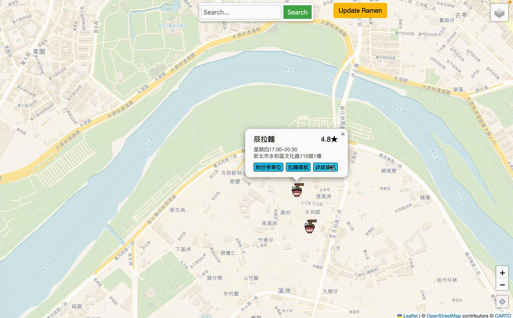
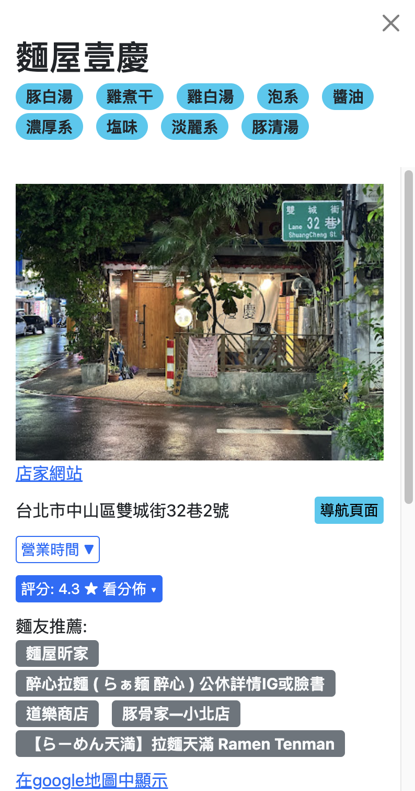

# Taiwan Ramen Map

[Visit Taiwan Ramen Map](https://ramentaiwan.info)

## Table of Contents
- [Taiwan Ramen Map](#taiwan-ramen-map)
  - [Table of Contents](#table-of-contents)
  - [Objective](#objective)
  - [Features](#features)
  - [Infrastructure](#infrastructure)
  - [Deployment](#deployment)

## Objective
Taiwan Ramen Map is designed to provide an interactive and user-friendly platform for ramen enthusiasts and newcomers, offering real-time updates, dynamic searches, and similar ramen restaurant recommendations.

## Features
- **Real-time Report**: Users can report and view live restaurant conditions, such as the queue length, using Flask and Socket.IO.
  - 
- **Search by Name**: Fast query capability using RediSearch to reduce latency and lighten the load on MongoDB.
  - 
- **Dynamic Map**: Provides dynamic search for nearby ramen restaurants, displaying unique characteristics, store details, and nearby parking options using MongoDB for fast geospatial queries.
   - 
- **Recommendation System**: Content-based filtering with text embeddings from user reviews and comments to recommend the top 5 related ramen restaurants.
  - 
- **Multi-vehicle Route Optimization**: Offers current fastest route planning considering public bike shares and other public transit options using a multi-stop and multi-vehicle route planner.
  - Route planner will show routes on map and cooperate with navigation instructions of each sub-route.
  - Route planner will suggest a combined route considering YouBike2.0 as vehicle if the origin plan needs bus change.
  - 

## Infrastructure

- **Data Pipeline Automation**: Automated data pipeline triggered by EventBridge to fetch ramen information and update recommendations based on new reviews using AWS Lambda, SQS, and EC2.
- **Service Monitoring**: Utilizes AWS CloudWatch to monitor application logs, service status, and alarm notifications.

## Deployment
1. **Clone the Repository**
   ```bash
   git clone https://github.com/yourusername/taiwan-ramen-map.git
   ```
2. 
